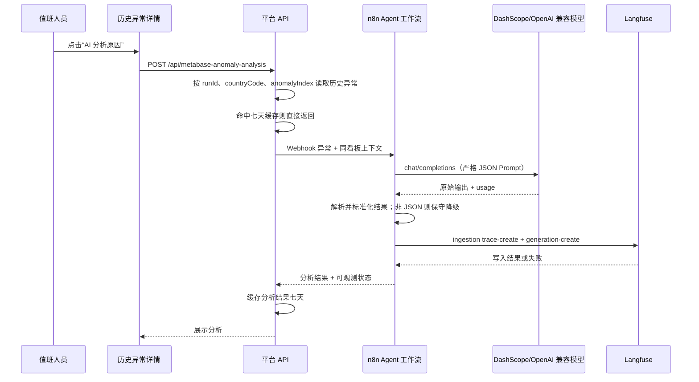

# Metabase 异常原因分析 Agent 设计

## 1. 目标

当 Metabase 巡检发现异常时，值班人员可以在历史详情中对单条异常发起只读分析。Agent 基于已保存的巡检证据，输出可执行的排查建议，而不是只重复告警文案。

输出固定包含：

- 现象摘要
- 可能原因，最多 3 条
- 核查步骤，最多 3 条
- 建议处理，最多 3 条
- 置信度：`low`、`medium`、`high`
- 限制说明

## 2. 非目标与安全边界

- 不执行 SQL，不访问数据仓库、DolphinScheduler 或 Metabase 管理接口。
- 不修改报表、规则、数据、任务或通知配置。
- 不自动发群消息，必须由用户在历史异常卡片中手动点击触发。
- 不发送机器人令牌、Metabase 凭证、DS Token 或其他配置密钥给模型或 Langfuse。
- 只发送已保存的异常证据：国家、巡检时间、看板、卡片、规则类型、原始异常消息，以及最多 5 条同看板异常。

## 3. 调用链



## 4. 证据与 Prompt

模型请求由两条消息组成：

1. `system`：限定只能按证据推断、禁止编造数据与修复结果、要求仅输出 JSON。
2. `user`：JSON 化巡检证据。

证据结构：

```json
{
  "anomaly": {
    "dashboardTitle": "OKR",
    "dashboardUrl": "https://data.example/dashboard/123",
    "cardTitle": "转化漏斗",
    "type": "latestNonZeroToZero",
    "message": "指标从 0.1 降为 0"
  },
  "run": {
    "runId": "...",
    "startedAt": "...",
    "countryCode": "PH",
    "countryName": "菲律宾"
  },
  "sameDashboardAnomalies": []
}
```

模型输出约束：

```json
{
  "summary": "现象摘要",
  "possibleCauses": ["可能原因"],
  "verificationSteps": ["核查步骤"],
  "recommendedActions": ["建议处理"],
  "confidence": "medium",
  "limitations": "证据限制"
}
```

## 5. 模型调用

推荐由 n8n 承担 OpenAI 兼容调用，平台只调用 n8n Webhook：

```text
POST ${METABASE_ANOMALY_AGENT_N8N_WEBHOOK_URL}
Authorization: Bearer ${METABASE_ANOMALY_AGENT_N8N_TOKEN}
```

n8n 工作流文件为本地私有的 `n8n-metabase-anomaly-agent.json`，该文件被 Git 忽略，不随代码仓库分发。平台只调用其 Webhook；凭证由 n8n 工作流或 n8n Variables 持有。

未配置 n8n 时，兼容保留直接调用 OpenAI 兼容模型的模式：

```text
POST ${METABASE_ANOMALY_AGENT_BASE_URL}/chat/completions
Authorization: Bearer ${METABASE_ANOMALY_AGENT_API_KEY}
```

请求含 `model`、`messages`、`temperature: 0.2`、`stream: false`。模型调用超时为 30 秒。

若模型成功返回但内容不是可解析 JSON，不直接报错，而是返回低置信度保守结果，提示值班人员使用原始告警与历史详情人工核查。模型 HTTP 调用失败则向前端返回可读错误，不写成功分析缓存。

## 6. Langfuse 可观测性

配置 Langfuse 后，Agent 向：

```text
POST ${METABASE_ANOMALY_LANGFUSE_BASE_URL}/api/public/ingestion
Authorization: Basic base64(publicKey:secretKey)
```

一次分析写入一个 batch，包含：

- `trace-create`：名称为 `Metabase 异常原因分析助手`，以巡检 `runId` 作为 sessionId；输入为 Prompt，输出为结构化分析。
- `generation-create`：记录模型名、Prompt、原始模型输出、输入/输出/总 Token、受限证据、解析后的结果和是否走格式降级。

Langfuse 写入是最佳努力行为。写入失败会返回 `observability.written=false` 和简短错误，但不会阻断分析结果。

## 7. 缓存与留存

缓存键：`runId:countryCode:anomalyIndex`。

分析缓存保存在 `config/metabase-anomaly-analyses.json`，与巡检历史一样保留最近 7 天，并被 Git 忽略。相同异常再次查看直接返回缓存，避免重复模型调用与重复 Langfuse generation。

## 8. 配置

必要模型配置：

```dotenv
METABASE_ANOMALY_AGENT_ENABLED=true
METABASE_ANOMALY_AGENT_BASE_URL=https://dashscope-intl.aliyuncs.com/compatible-mode/v1
METABASE_ANOMALY_AGENT_API_KEY=your-model-api-key
METABASE_ANOMALY_AGENT_MODEL=qwen3.7-plus
```

可选 Langfuse 配置：

```dotenv
METABASE_ANOMALY_LANGFUSE_ENABLED=true
METABASE_ANOMALY_LANGFUSE_BASE_URL=https://your-langfuse-host
METABASE_ANOMALY_LANGFUSE_PUBLIC_KEY=pk-...
METABASE_ANOMALY_LANGFUSE_SECRET_KEY=sk-...
```

也支持 `LANGFUSE_BASE_URL`、`LANGFUSE_PUBLIC_KEY`、`LANGFUSE_SECRET_KEY` 作为通用环境变量回退。

## 9. 实现映射

- Agent 与 Langfuse ingestion：`src/metabase-anomaly-agent.mjs`
- 历史异常定位、缓存和七天清理：`src/platform-api.mjs`
- HTTP 路由：`src/server.mjs`
- 历史详情按钮和展示：`web/src/views/batch-check.js`
- 使用说明：`docs/metabase-anomaly-agent.md`

## 10. 验证

测试覆盖：OpenAI 兼容调用、未配置拒绝、模型非 JSON 降级、Langfuse batch 的 trace/generation 与 Token 字段、后端历史定位与缓存、页面入口。

运行：

```bash
npm test
```
