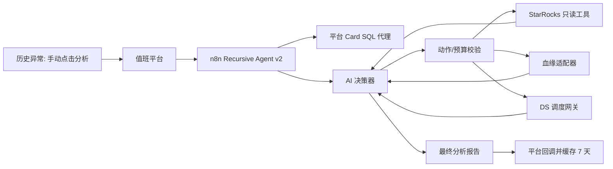

# Metabase 递归数据侧取证 Agent v2

## 目标

v2 用于回答一个明确问题：**Metabase 告警是底层数据问题、真实业务变化，还是证据不足？**

与当前一次性总结不同，v2 会在严格预算内重复执行“AI 决策 -> 受控工具取证 -> AI 决策”，可以从卡片 SQL 的 ADS 表继续追溯到上游 DWS、DWD、ODS，并在必要时查询对应 DS 工作流。

它不会修改数据、报表、规则或调度任务；现有巡检告警仍按原规则发送，v2 初期只补充历史详情中的分析结果。

## 架构



## 角色划分

- **AI 决策器**：只能选择下一项动作，不能直接执行 SQL、SSH 或修改任务。
- **n8n 编排器**：验证动作、执行工具、截断结果、累计预算并回传证据。
- **平台**：提供历史异常、受已有 Metabase 凭证保护的 Card SQL 读取代理、回调和七天缓存。
- **血缘适配器**：公共的数仓代码血缘网关，返回已验证的上游表、ETL SQL 或 DS 项目/工作流引用。它必须是真实数据源，不能用猜测的 HTTP URL 代替。

## 受控动作

| 动作 | 允许的输入 | 证据输出 |
| --- | --- | --- |
| `get_card_sql` | 当前异常的 cardId | 原始 SQL、数据库、参数信息 |
| `describe_table` | 已发现的合法表名 | DDL、分区列、刷新字段 |
| `check_partition` | 表名、异常日、对比日 | 两天分区/行数/聚合摘要 |
| `trace_upstream` | 已发现的表名 | 上游表和关联 DS/代码引用 |
| `check_ds` | 血缘返回的项目、工作流 | 最近实例状态和失败根因 |
| `finalize` | 无 | 最终结构化报告 |

AI 只可从当前 `frontier` 选择表；SQL 由工具模板根据表名和日期生成。禁止模型输出任意 SQL。

## 状态与预算

每个任务维护如下状态，状态由 n8n 传递，不写入模型提示以外的私密信息：

```json
{
  "jobId": "mba-...",
  "frontier": [{ "table": "ads_xxx", "layer": "ads", "depth": 0 }],
  "visitedTables": ["ads_xxx"],
  "evidence": [],
  "budget": {
    "maxDepth": 4,
    "maxToolCalls": 12,
    "maxTablesPerStep": 5,
    "deadlineSeconds": 180
  }
}
```

停止条件：达到深度/调用/时限、血缘无上游、发现数据已正常、或 AI 返回 `finalize`。超限时必须输出 `insufficient_evidence`，不得把猜测升级为数据故障。

## AI 决策契约

模型每轮只能返回以下 JSON，n8n 校验失败即终止并保守结案：

```json
{
  "action": "check_partition",
  "targets": ["dwd_example"],
  "reason": "ADS 分区缺失，需要确认上游是否已产出",
  "stop": false
}
```

`action` 仅允许受控动作；`targets` 最多 5 个且必须在当前 `frontier` 或血缘刚返回的上游表中。

## 血缘适配器是上线前置条件

当前项目没有可验证的在线血缘 REST API。之前直接请求 `data-map-dev` 的猜测路径会得到 403，因此已不再使用。

本项目已提供可导入的 [公共数仓代码血缘网关](warehouse-lineage-gateway.md) 和 [n8n 六国代码血缘网关模板](../n8n-warehouse-lineage-gateway.template.json)。它复用现有六国跳板机 Credential，只读检索以下目录：

- 中国：`/data/git/starrocks/workflow/cn`
- 菲律宾：`/data/git/starrocks/workflow/ph`
- 印尼：`/data/git/starrocks/workflow/ine`
- 泰国：`/data/git/starrocks/workflow/th`
- 巴基斯坦：`/data/git/starrocks/workflow/pk`
- 墨西哥：`/data/git/starrocks/workflow/mx`

网关仅接受合法表名，使用代码搜索抽取命中文件、上游表候选和 DS 引用；不执行仓库内脚本，不写入仓库，也不接收任意 Shell 命令。

接入方式：

1. 在 n8n 导入血缘网关模板并发布，Production URL 例如 `http://127.0.0.1:5678/webhook/warehouse-lineage`。
2. 它在对应仓库执行受控的静态代码检索，输入表名，输出 `matchedFiles`、`upstreamTables`、`dsRefs`。
3. 递归 Agent 只访问该网关的 `POST /webhook/warehouse-lineage`，不直接 SSH 或暴露仓库凭证。
4. 网关返回空结果时表示“未找到证据”，不表示没有上游。

契约：

```json
{
  "countryCode": "ID",
  "table": "ads_example",
  "maxDepth": 1
}
```

```json
{
  "success": true,
  "upstreamTables": ["dws_example"],
  "etlSqlRefs": [{ "path": "jobs/example.sql", "line": 18 }],
  "dsRefs": [{ "projectCode": "...", "workflowCode": "..." }]
}
```

## n8n 部署

1. 导入 [n8n-metabase-anomaly-recursive-agent.template.json](../n8n-metabase-anomaly-recursive-agent.template.json)。
2. 在 n8n Variables 中设置 `DASHSCOPE_API_KEY`、`SR_BOX_BASE_URL`、`LINEAGE_GATEWAY_URL`；令牌请放 n8n Credential，不要写入 Git 模板。
3. 给 SR Box Credential 仅授予 `SELECT`、`SHOW`、`DESC`、`EXPLAIN`。
4. 将模板中的“血缘适配器”请求地址配置为实际网关，确认它能返回上面的契约。
5. 发布工作流，取得 Production Webhook URL。
6. 平台 `.env` 配置：

```dotenv
METABASE_ANOMALY_AGENT_ENABLED=true
METABASE_ANOMALY_AGENT_N8N_WEBHOOK_URL=http://127.0.0.1:5678/webhook/metabase-anomaly-recursive-agent
METABASE_ANOMALY_AGENT_MODE=recursive_evidence
```

平台和 n8n 同机 Docker 时，模板回调地址使用 `http://172.19.0.1:28787`；该地址已由平台默认回调配置生成。

## 灰度

1. 先仅在历史详情手动点击，对 3 个已知异常验证。
2. 对比 Agent 结论与人工排查结果，确认 `evidenceChain` 包含真实表和 DS 证据。
3. 再启用“巡检异常自动取证”。自动取证失败只补充失败原因，绝不抑制原始严重告警。
4. 稳定后才允许基于 `data_issue/business_change` 调整通知等级。
