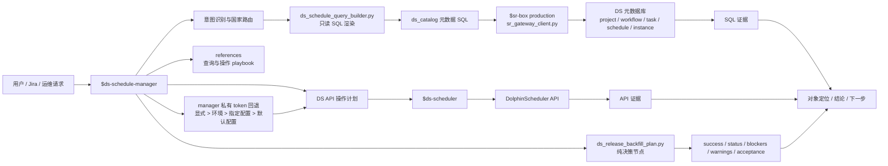

# DS Schedule Manager 架构说明

> 作者：owenzhang
> 模块 ID：`ds-schedule-manager`
> 适用范围：DolphinScheduler 调度对象定位、上线/下线核查、运行诊断、生产发布、历史补数、日志拉取计划和安全操作计划。

`ds-schedule-manager` 是调度管理编排 skill，不替代 `$sr-box` 和 `$ds-scheduler`。它的核心职责是判断 DS 需求应该先查哪些元数据、再生成哪些计划、调用哪些 DS API，以及如何把 SQL、计划和 API 三类证据分开汇报。

## 总体架构



## 组件职责

| 组件 | 位置 | 职责 | 边界 |
|---|---|---|---|
| skill 编排 | `SKILL.md` | 定义 DS 查询、诊断、操作计划和输出格式 | 不直接修改 DS 状态 |
| SQL 渲染器 | `scripts/ds_schedule_query_builder.py` | 根据国家和查询类型生成 `ds_catalog` 只读 SQL | 不连接数据库、不执行 SQL |
| 发布补数计划器 | `scripts/ds_release_backfill_plan.py` | 读取 YAML/JSON 并输出 `success`、`status`、`blockers`、`warnings`、`acceptance` 确定性计划 | 无副作用；不执行 SQL、不调用 DS API、不读取 token/secret |
| 元数据查询执行 | `$sr-box` / `/Users/admin/.codex/skills/sr_box/scripts/sr_gateway_client.py` | 执行 DS 元数据 SQL，返回 workflow、task、schedule、instance 证据 | 只读，不能上线/下线/重跑 |
| 操作执行 | `$ds-scheduler` | 调 DS API 获取实时对象、日志，或在确认后执行上线、下线、重跑等动作 | 修改动作必须用户确认 |
| token 管理 | `scripts/ds_token_manager.py` | 管理 `~/.codex/secrets/ds-schedule-manager/tokens.json`，按国家解析回退 token | 文件权限 `0600`，不回显 token，不改变权限范围 |
| 安全请求构造 | `scripts/ds_scheduler_with_default_token.py` | 调用方无 token 时解析 manager 默认值，再显式交给 `$ds-scheduler` builder | 只写 `0600` 私有 payload；`$ds-scheduler` 仍不持久化 token |
| 查询参考 | `references/metadata-query-playbook.md` | 国家路由、表结构、状态枚举、常见 SQL 模板 | 不作为 live 结果替代 |
| 操作参考 | `references/operation-playbook.md` | 查询结果到 DS API action 的映射、payload 和验证方式 | 不保存真实 token |
| 发布补数参考 | `references/production-release-backfill-playbook.md` | 计划器语义、外部预检、冒烟守卫和六层验收 | 不代替 live SQL/API 证据 |

## 国家路由

`ds-schedule-manager` 通过 `CountryConfig` 把业务国家、SR 查询国家、DS API 国家和元数据库分开处理：

| 输入国家 | SR country | DS API country | 元数据库 | DS 定义表风格 |
|---|---|---|---|---|
| `cn` | `cn` | `cn` | `cn_dolphin` | `workflow` |
| `th` | `th` | `th` | `dolphin_scheduler` | `workflow` |
| `mx` | `mx` | `mx` | `mex_dolphin` | `process` |
| `ph` | `ph` | `ph` | `phl_dolphin` | `process` |
| `pk` | `pk` | `pk` | `pak_dolphin` | `workflow` |
| `id` | `id` | `ine` | `dolphin_scheduler` | `workflow` |

表风格决定定义表、实例表和 relation 字段命名，例如 `workflow` 使用 `t_ds_workflow_definition`，`process` 使用 `t_ds_process_definition`。

## 证据来源分层

| 证据类型 | 调用方 | 用途 | 可信边界 |
|---|---|---|---|
| SQL 元数据证据 | `$sr-box` 执行 `ds_catalog` SQL | 定位 project/workflow/task/schedule/instance，统计状态，找 log_path | 反映元数据库快照，不代表 API 已执行动作 |
| `计划证据` | `ds_release_backfill_plan.py` | 汇总 `success`、`status`、`blockers`、`warnings`、`acceptance` | 纯决策输出，不代表 SQL 或 DS API 已执行 |
| DS API 证据 | `$ds-scheduler` | 查看实时 workflow/schedule/log/action response，执行受控动作 | 需要 token 和权限；修改动作需要确认 |
| 本地参考 | `references/` | 说明查询路径、状态枚举、操作 payload 模板 | 不能代替 live SQL/API 结果 |

回答时必须把三类证据拆开写：`SQL 证据`、`计划证据` 和 `API 证据`。计划证据固定报告 `success`、`status`、`blockers`、`warnings`、`acceptance`；如果只有计划证据，不应暗示 SQL 或 DS API 已执行。

## 标准调用流程

1. 识别意图：查表调度、查 workflow、查失败任务、查日志、上线/下线、重跑或修改任务。
2. 解析国家和对象名，必要时先要求补充国家、表名、workflow 名或时间范围。
3. 用 `ds_schedule_query_builder.py` 生成只读元数据 SQL。
4. 通过 `$sr-box` production 执行 SQL，获取对象定位和状态证据。
5. 对生产发布或历史补数，先检查 definition、完整 DAG、global params、数据源、权限、DDL/DML、安全 SQL 前置和 gateway capability，再运行纯决策计划器。
6. 如果计划含 `blockers`，停止移交；如果 `TASK_ONLY` 未覆盖完整 required task 集合，也停止移交。
7. 如果用户需要实时日志、实例详情或调度操作，先按“显式 token > 环境变量 > 指定配置 > 默认配置”解析 token。
8. 用 `$ds-scheduler` 执行 API 调用；它继续要求显式收到 token，不读取或保存 manager 配置。
9. 对任何修改动作，先展示影响范围、token-free payload 摘要和回查方式，并等待用户明确确认。
10. 修改完成后尽量用 SQL + API 双重回查，分别记录结果；补数覆盖与 ONLINE schedule 分开给出结论。

## 生产发布与历史补数计划节点

计划器只负责把 YAML/JSON 请求转换为确定性决策结果：

```bash
python3 skills/ds-schedule-manager/scripts/ds_release_backfill_plan.py \
  release-backfill-request.yaml \
  --output release-backfill-plan.json
```

| 输入 | 输出 | 副作用 |
|---|---|---|
| country、project/workflow、definition、DAG、gateway、backfill、preflight、runtime evidence、schedule 的 YAML/JSON | `success`、`status`、`blockers`、`warnings`、`acceptance` | 无；不执行 API/SQL，不读取 token/secret，不改变 DS 状态 |

计划器的 `success=true` 只表示计划决策可继续，不表示 DS 执行成功。真实上线、触发、补数或 schedule mutation 始终由 `$ds-scheduler` 执行，并要求用户明确确认。

## 常见查询类型

| Query | 用途 | 关键参数 |
|---|---|---|
| `summary` | 统计 workflow、schedule、近 7 天实例状态 | `country` |
| `table-to-task` | 查某张表被哪些 task/workflow 使用 | `country`、`table-name` |
| `workflow-schedule` | 查 workflow 和 schedule 上线状态 | `country`、`workflow-code` 或 `workflow-name` |
| `recent-task-runs` | 查 task 最近执行情况和 log_path | `country`、`task-code`、`days` |
| `failed-tasks` | 查项目最近失败任务 | `country`、`project-code`、`days` |
| `slow-tasks` | 查项目慢任务 | `country`、`project-code`、`days` |
| `daily-table-case` | 对日常表调度做组合排查 | `country`、`table-name` |

示例：

```bash
python3 skills/ds-schedule-manager/scripts/ds_schedule_query_builder.py \
  --country cn \
  --query table-to-task \
  --table-name dwd_fox_asset_withhold_detail
```

## 修改动作守卫

以下动作只允许通过 `$ds-scheduler`，且必须先拿到用户明确确认：

- `online_schedule`
- `offline_schedule`
- `retry_instance`
- `append_sql_task`
- `append_shell_task`
- `update_sql_task`
- `update_shell_task`
- `disable_task`
- `disable_tasks_except`
- `delete_task`

遇到 workflow definition 修改动作时，必须先提示：

```text
这是改 workflow definition，不是简单改任务状态；如果是同步类工作流，先检查 global_params 是否为空，以及脚本是否引用 ${src}/${db}/${dt}/${full}/${partition}/${complement}。
```

以下情况阻断执行：

- `project_code / workflow_code / task_code` 不唯一。
- workflow 的 `global_params` 为空，但脚本引用了 workflow 变量。
- 存在 `SUB_WORKFLOW` 父子影响但未检查。
- shared schedule 或多任务影响范围未确认。
- 用户没有明确确认修改。
- 显式 token 和 manager 默认 token 都不可用，或 token 权限不足。

## 输出结构

每次 DS 管理回答建议固定为：

1. `对象定位`：country、project、workflow、task、schedule、instance。
2. `SQL 证据`：路由、SQL 类型、行数、关键字段、限制。
3. `计划证据`：`success`、`status`、`blockers`、`warnings`、`acceptance`；未运行时说明原因。
4. `API 证据`：调用了哪个 `$ds-scheduler` action；未调用时说明原因。
5. `结论`：online、offline、running、success、failure、not found 或 blocked。
6. `下一步`：拉日志、重跑、下线 schedule、禁用任务、继续观察或无需动作。

## 设计原则

- DS 需求优先使用本 skill 做编排，日常 SR 查询偏好不能覆盖 DS 元数据路径。
- 日常查询默认先查 `$sr-box` 生产 `ds_catalog` 元数据，再按需调用 `$ds-scheduler`。
- 不打印真实 `ds_token`，不把 token 写进文档或 payload。
- 私有运行时 payload 是唯一例外，必须为 `0600`，不得作为交付文档或日志内容。
- 不使用非指定 SR 查询入口。
- 不把参考文档里的历史验证当作当前 live 状态。
