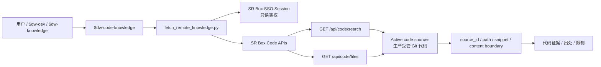

# dw-code-knowledge 架构说明

> 作者：owenzhang
> 模块 ID：`dw-code-knowledge`
> 适用范围：通过生产 SR Box 只读代码 API 查询数仓 Git 代码、ETL SQL、workflow 脚本、表构建逻辑和代码出处。

`dw-code-knowledge` 是独立授权的代码查看入口。它只负责通过 SR Box 代码 API 做只读检索和文件读取，不执行 SQL、不读取文档知识库、不管理 Git source，也不绕过权限读取本地工作区。

## 总体架构



## 职责边界

| 层次 | 组件 | 职责 | 不做什么 |
|---|---|---|---|
| 编排入口 | `SKILL.md` | 判断代码查看场景、定义 API 和权限边界 | 不处理文档知识 |
| 代码读取 helper | `scripts/fetch_remote_knowledge.py` | 调用生产 SR Box code search/file API | 不执行 SQL、不直接读本地 Git |
| 鉴权 | SR Skills SSO session 或 token env | 提供只读代码 API 鉴权 | 不绕过权限 |
| 远程代码源 | SR Box active code sources | 提供受管 Git 代码检索和文件读取 | 不在本 skill 内 pull/refresh/activate |
| 输出 | 检索摘要、文件正文、路径和来源 | 给 `$dw-dev`、`$dw-knowledge` 或开发者提供代码事实 | 不生成上线 SQL package |

## API 面

生产默认 base URL：

```text
https://data-map-dev.kuainiu.io
```

只读代码接口：

| 接口 | 用途 |
|---|---|
| `GET /api/code/search?q=<query>` | 按表名、任务名、脚本名、关键词检索受管代码源 |
| `GET /api/code/files?path=<code-source-relative-path>` | 读取指定代码文件内容 |

helper 鉴权来源按当前实现读取：`--token`、`WS_CODE_KNOWLEDGE_API_TOKEN`、`WAREHOUSE_KNOWLEDGE_API_TOKEN`、`FUXI_API_TOKEN` 或 `~/.config/sr-skills/session-data-map-dev.json`。

## 标准调用流程

1. 确认用户问题属于代码事实：ETL SQL、workflow 脚本、表构建逻辑、代码出处或文件正文。
2. 如果用户给的是表名、任务名或关键词，先调用 `code-search`。
3. 从搜索结果中选择明确的 `source_id/path`；若结果不唯一，返回候选并让用户确认。
4. 用户给出精确路径或搜索结果唯一时，调用 `code-file` 读取文件。
5. 输出时标注来源、路径、命中片段或正文边界，避免把代码内容当成已执行结果。
6. 如果 API 拒绝访问，说明代码查看权限不可用，并停止；不能退回到本地 Git 目录绕过权限。

示例：

```bash
python3 skills/dw-code-knowledge/scripts/fetch_remote_knowledge.py \
  --profile prod \
  --operation code-search \
  --query "dwb_fox_mission_recovery_d"

python3 skills/dw-code-knowledge/scripts/fetch_remote_knowledge.py \
  --profile prod \
  --operation code-file \
  --path "th/dwb_fox_mission_recovery_d.sql"
```

## 与其他 skill 的关系

| 协作对象 | 调用时机 | 交接内容 |
|---|---|---|
| `$dw-dev` | 需求开发需要验证代码事实 | 表名、需求上下文、疑似脚本路径、代码证据 |
| `$dw-knowledge` | 文档知识不足，需要 ETL 或 workflow 作为事实补充 | 搜索词、source/path、文件片段 |
| `$dw-modeling` | 建模复用判断需要看已有表构建逻辑 | 现有 SQL 口径、依赖表、粒度线索 |
| `$dw-sql-builder` | SQL 编写要参考已有模式 | 可复用片段和来源路径 |
| 受控 source 管理入口 | 需要管理代码源、pull、refresh、activate | 本 skill 只提示移交，不执行管理动作 |

## 阻断条件

以下情况应停止或要求补充，而不是继续猜测：

- 搜索结果为空，且没有可替代的精确路径。
- 搜索结果过多，无法唯一判断目标代码。
- 代码 API 返回未授权或 token/session 不可用。
- 用户要求执行 SQL、查询生产数据、上线或修改代码源。
- 用户要求管理 Git source、刷新索引或激活 source。

## 输出要求

一次代码知识回答建议包含：

- `检索条件`：query 或 path。
- `来源`：source id、path、retrieved_at。
- `代码证据`：关键片段或文件摘要；长文件只摘关键段并说明边界。
- `结论`：对用户问题的回答，明确这是代码证据而非执行结果。
- `限制`：权限、路径不唯一、只读、未执行 SQL 等限制。

## 设计原则

- 搜索优先，精确路径读取其次；用户给出精确路径时可以直接读取。
- 只走生产 SR Box code API。
- 不读取 `/Users/admin/IdeaProjects/starrocks` 或 SR Box materialized source 目录。
- 不调用文档知识、Dify 知识或语义上下文接口；这些属于 `$dw-knowledge`。
- 不执行 SQL，不验证数据结果。
