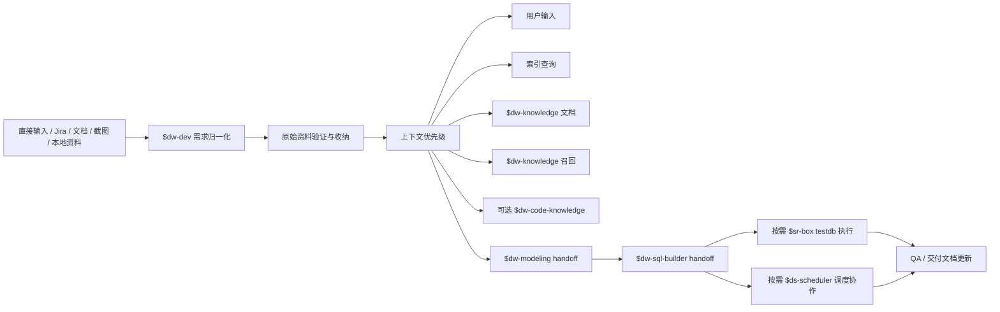

# DW Dev 使用说明

> 作者：owenzhang
> 模块 ID：`dw-dev`
> 展示名称：`数仓开发`

## 定位

`$dw-dev` 是数仓开发的轻量编排层。它不内置复杂分析、不替代建模、不写最终 SQL、不执行 SQL、不改调度；这些由 Codex 或 Claude Code 这类原生智能体协调下游 skill 完成。

核心职责是：

- 把直接提问、Jira、文档、本地资料和 SQL package 归一成 request。
- 把每次补充资料都收纳到 `原始资料`，截图、本地文件和 SQL 需要验证或标为阻断。
- 按优先级组织上下文：用户输入、索引查询、`$dw-knowledge` 文档、`$dw-knowledge` 召回、可选 `$dw-code-knowledge`。
- 生成中文工作区、参考资料附录、QA 记录、交付文档和协作请求。
- 在信息不足或执行不安全时停止并提问。
- 进入验证阶段时固定生成生产/testdb 表映射、系统验证 SQL和用户可直接执行的只读验收 SQL。

## 调用关系



## 输出目录

目录可按实际需求简化或扩展，但最小锚点要保留：

- `原始资料`: `00-原始提问.md` 和 `01-资料收纳清单.md`，每次补充资料都要进入这里。
- `上下文`
- `QA`: 需求问答、口径确认、需求调整和验收反馈。
- `交付文档`: 最新交付清单、上线材料、验收结果或待交付状态。

按阶段生成的目录：

- `需求文档`
- `参考资料`
- `开发计划`
- `协作请求`
- `test闭环sql`：包含 `00-生产-testdb表映射.yaml`、`01-系统验证.sql`、`02-用户验收.sql`。
- `验收结果`
- `调度上线`

默认不再生成旧路径：`05-sql`、`06-evidence`、`07-review.md`、`08-delivery.md`、`09-jira-comment.md`、`release/ds`。交付信息统一写入 `交付文档/00-交付清单.md`。

## 直接使用

建模优先：

```bash
python3 skills/dw-dev/scripts/build_dev_request.py \
  --ticket-id DATA-2232 \
  --country mx \
  --business-domain mgm \
  --user-input "基于 DATA-2111 和 DATA-2262 完成二期" \
  --jira-reference DATA-2232=https://kylith.atlassian.net/browse/DATA-2232 \
  --jira-reference DATA-2111=https://kylith.atlassian.net/browse/DATA-2111 \
  --jira-reference DATA-2262=https://kylith.atlassian.net/browse/DATA-2262 \
  --output tickets/DATA-2232/dev-request.yaml
```

生成工作区：

```bash
python3 skills/dw-dev/scripts/dev_orchestrator.py \
  tickets/DATA-2232/dev-request.yaml \
  --output-dir tickets/DATA-2232
```

进入执行阶段时同时提供三份验收材料：

```bash
python3 skills/dw-dev/scripts/build_dev_request.py \
  --ticket-id DATA-2232 \
  --country mx \
  --business-domain mgm \
  --context-status ready_for_sql_builder \
  --system-validation-sql-file ai_test/01-system.sql \
  --user-validation-sql-file ai_test/02-user.sql \
  --table-mapping-file ai_test/00-table-mapping.yaml \
  --output tickets/DATA-2232/dev-request.yaml
```

## 边界

- `$dw-dev` 不直接执行 SQL；真实执行由 `$sr-box` 完成。
- 写验证必须显式写入 `testdb.<table>`。
- 生产输出表和 testdb 表必须一一对应；优先使用 `CREATE TABLE testdb.<table> LIKE <生产表>` 保持表模型一致。
- 用户验收 SQL 必须只读，写明结果列和通过条件，使用者可以直接执行查看结果。
- `$dw-modeling` 和 `$dw-sql-builder` 的输出是草稿或 handoff，不是执行证据。
- `$ds-scheduler` 只有在用户明确要求调度或 DS 操作时才出现。
- 交付文档只记录当前交付状态；外部发送、Jira 回写、正式发布仍由原生智能体按需协调。
