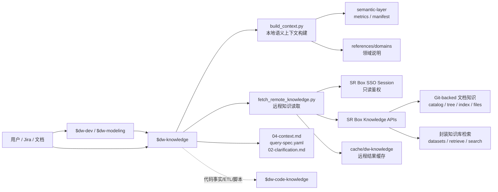

# dw-knowledge 架构说明

> 作者：owenzhang
> 模块 ID：`dw-knowledge`
> 适用范围：生产数仓文档知识、语义上下文、知识库检索、query spec 和 clarification 生成。

`dw-knowledge` 是数仓开发链路里的非代码知识入口。它负责把用户输入、需求文档或 `$dw-dev` 传入的需求，整理成可引用、可审查的上下文材料；它不执行 SQL，也不查看 ETL 代码。遇到代码事实、workflow 脚本或表构建逻辑时，应交给 `$dw-code-knowledge`。

## 总体架构



## 职责边界

| 层次 | 组件 | 职责 | 不做什么 |
|---|---|---|---|
| 编排入口 | `SKILL.md` | 定义何时使用、上下文优先级、远程 API、边界和阻断规则 | 不直接执行业务查询 |
| 本地语义构建 | `scripts/build_context.py` | 基于 `01-requirement.yaml`、semantic-layer 和领域 references 生成上下文、query spec、clarification | 不联网、不读取代码 |
| 远程文档读取 | `scripts/fetch_remote_knowledge.py` | 通过生产 SR Box 知识 API 读取目录、版本、索引、文件和封装知识检索 | 不绕过 API 直接读 Git 工作区 |
| 缓存目录 | `<skills-root>/cache/dw-knowledge` | 保存远程读取结果，便于后续引用和对比 | 不把业务知识写进 skill 目录 |
| 下游产物 | `04-context.md`、`query-spec.yaml`、`02-clarification.md` | 交给 `$dw-dev`、`$dw-modeling`、`$dw-sql-builder` 继续开发 | 不生成上线 SQL package |

## 上下文优先级

`dw-knowledge` 只处理知识和上下文，不替代用户输入。上下文采纳顺序如下：

1. 用户本轮直接输入、截图、文档片段、Jira 说明。
2. `$dw-dev` 或 `$dw-modeling` 已经整理好的需求上下文。
3. Git-backed 文档知识 API 返回的受管文档、domain index、文件正文。
4. 封装知识库检索返回的相似资料和语义参考。
5. 本地 semantic-layer 与 references/domain 兜底结果。

当不同来源冲突时，优先保留用户当前输入，并在输出中记录冲突点、来源和待确认问题。

## 远程知识接口

生产默认 base URL：

```text
https://data-map-dev.kuainiu.io
```

主要只读接口：

| 类型 | 接口 | 用途 |
|---|---|---|
| 知识目录 | `GET /api/knowledge/catalog` | 查看可用知识源和目录 |
| 领域树 | `GET /api/knowledge/tree?domain=<domain>` | 查看某个 domain 的文档树 |
| 版本信息 | `GET /api/knowledge/domains/{domain}/version` | 判断知识包版本和新鲜度 |
| 索引信息 | `GET /api/knowledge/domains/{domain}/index` | 读取 domain index |
| 增量变更 | `GET /api/knowledge/domains/{domain}/changes?since=<localVersion>` | 对比本地缓存与远端差异 |
| 文档搜索 | `GET /api/knowledge/search?q=<query>&domain=<domain>` | 在 Git-backed 文档中检索 |
| 文件正文 | `GET /api/knowledge/files?path=<path>` | 读取受管知识文件 |
| 文档详情 | `GET /api/knowledge/domains/{domain}/docs/{docId}` | 读取指定文档 |
| 知识库检索 | `POST /api/knowledge/dify/datasets/{datasetId}/retrieve` | 召回相似知识片段 |
| 封装搜索 | `POST /api/knowledge/search` | 统一知识搜索入口 |

鉴权来源按 helper 当前实现读取：`--token`、`WS_KNOWLEDGE_API_TOKEN`、`WAREHOUSE_KNOWLEDGE_API_TOKEN`、`FUXI_API_TOKEN` 或 SR Skills SSO session 文件。生产 session 默认是 `~/.config/sr-skills/session-data-map-dev.json`。

## 标准调用流程

1. 判断需求是否属于文档知识、语义上下文或 clarification。
2. 先合并用户输入和已有需求材料，保留来源。
3. 如有 `01-requirement.yaml`，用 `build_context.py` 生成本地初版上下文。
4. 对需要最新文档的 domain，使用 `fetch_remote_knowledge.py` 调用生产知识 API。
5. 将远程证据写入缓存或产物附录，标注 domain、source、path、version、retrieved_at。
6. 若信息足够，输出 `04-context.md` 或 query spec；若关键信息缺失，输出 `02-clarification.md`。
7. 若用户追问 ETL、workflow、代码出处，停止在本 skill 内继续展开，改走 `$dw-code-knowledge`。

## 阻断条件

以下情况应停止并说明阻断，而不是编造上下文：

- 无法唯一识别国家、时间范围、业务口径或 canonical table。
- semantic/reference/远程文档都没有匹配证据。
- 远程 API 权限不可用，且本地材料不足以支撑结论。
- 用户要求读取代码、ETL SQL、workflow 脚本，但 `$dw-code-knowledge` 未安装或不可用。
- 需求需要执行 SQL、上线、回写 Jira 或发送消息。

## 与其他 skill 的关系

| 协作对象 | 调用时机 | 交接内容 |
|---|---|---|
| `$dw-dev` | 需求开发入口需要补知识上下文 | `04-context.md`、资料附录、阻断项 |
| `$dw-modeling` | 需求要做分层、粒度、主键、复用判断 | 语义命中、领域文档、待确认口径 |
| `$dw-sql-builder` | 建模方案明确后需要写 SQL | query spec、表/字段口径、约束说明 |
| `$dw-code-knowledge` | 需要 ETL、workflow、代码事实 | 搜索词、表名、疑似路径、上下文摘要 |
| 受控 source 管理入口 | 管理知识源、pull、refresh、activate | 本 skill 只提示，不代替执行 |

## 输出要求

架构链路产物建议至少包含：

- `来源摘要`：用户输入、文档、Jira、远程知识、缓存路径。
- `上下文结论`：已确认事实、可用表、字段、口径和时间约束。
- `证据附录`：API、domain、path、version、retrieved_at。
- `待确认问题`：阻断项和建议提问。
- `下游建议`：交给建模、SQL 构建、代码知识或 DS 调度的下一步。
