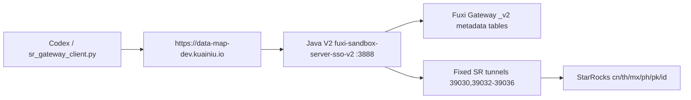

# 数据查询 / SR Box Production Architecture

`sr-box` defaults to the production Java V2 gateway:

```text
https://data-map-dev.kuainiu.io
```

Local development belongs to `$data-query-dev / 数据查询开发`, which targets:

```text
http://127.0.0.1:4888
```

## Call Chain



## State Isolation

Production skill state:

- `~/.config/sr-skills/session-data-map-dev.json`
- `~/.config/sr-skills/token-data-map-dev.json`

Local development skill state:

- `~/.config/sr-skills/session-local-dev.json`
- `~/.config/sr-skills/token-local-dev.json`

Use environment overrides only for one-off diagnostics. Do not store production tokens in the repository or documentation.

## Query Flow

1. Build request with production base URL.
2. Resolve auth: CLI token, environment token, production SSO session, production SSO login, production shared token, then `fuxi_demo_token`.
3. Validate SQL locally for hard `testdb` write safety.
4. Call `/api/rust/v1/sr-sandboxes/sql-executions`.
5. Summarize `success`, `traceId`, rows, duration, and `_client.permissionSummary`.

## Environment Boundaries

- `https://data-map-dev.kuainiu.io`: current production/data-map Java V2 service.
- `https://sr-box.kuainiu.io`: legacy 4888 service, explicit inspection only.
- `http://127.0.0.1:4888`: local development only; use `$data-query-dev`.
